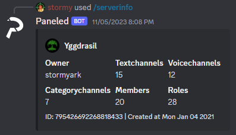
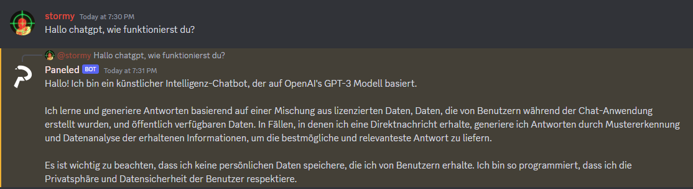

## Discord bot

A simple discord Bot with basic features.

## .env File

A ".env" file serves as a secure repository for managing configuration variables in a software project.
Put the following variables in you .env file:
- TOKEN=your_discord_bot_token
- GUILD_ID=your_discord_server_id
- CLIENT_ID=your_discord_bot_client_id
- OPENAI_API_KEY=your_openai_api_key

## Features

-Serverinfo

-ChatGPT

-Ban & Kick
